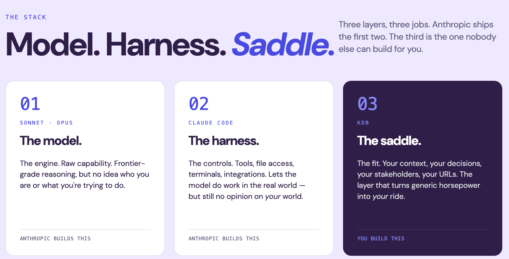
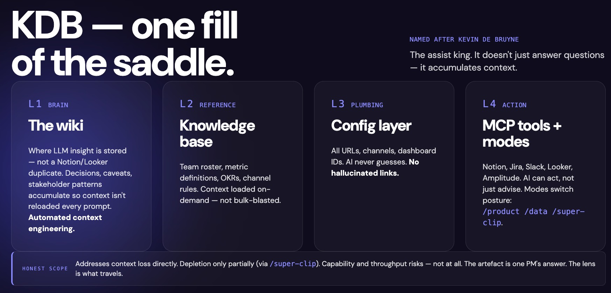
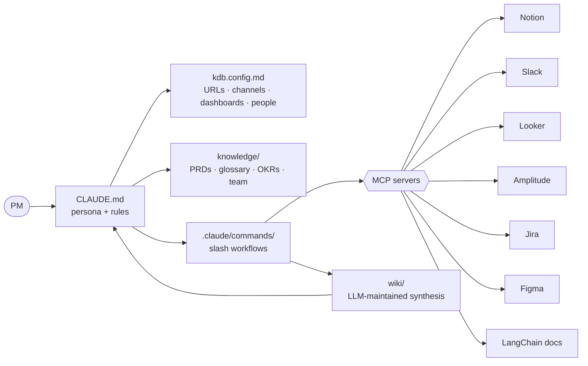
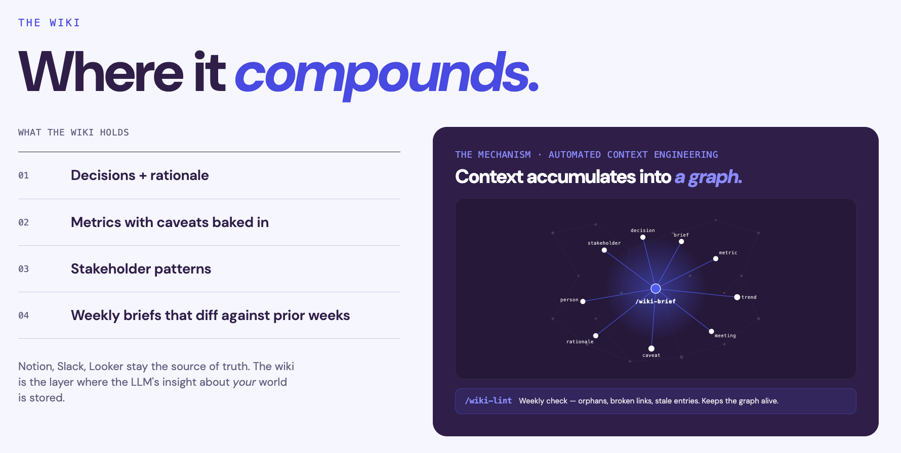

# KDB: the AI assist

[](./LICENSE)
[](https://claude.ai/code)
[](https://modelcontextprotocol.io)
[](https://gist.github.com/karpathy/442a6bf555914893e9891c11519de94f)

> Named after Kevin De Bruyne, the assist king. Sets up your PMs to score.

Most PMs use AI the same way: one-shot prompts, every session starting cold. The model knows nothing about your team, your decisions, or the context behind them. The synthesis burden stays with you.

KDB is the missing layer. It builds a compounding knowledge base around your specific world: your stakeholders, your metrics, your decisions, your URLs. After a few weeks it stops being a tool and starts being context you've already done the work to build.



---

## What this is

A Claude Code template for product managers. Fork it, point it at your stack, and you have an AI assistant that knows your team, tracks your metrics, maintains a synthesis wiki, and gets smarter every week. Everything lives in plain Markdown. Drafts before posting anywhere.



---

## What you get

- **A wiki that compounds**: LLM-maintained synthesis in `wiki/`. Decisions, metrics, stakeholder patterns accumulated so context is not rebuilt every prompt
- **14 slash commands**: Pre-built PM workflows for briefs, stakeholder prep, reflection, competitor pricing. Each loads only the context it needs
- **7 integrations via MCP**: Notion, Slack, Jira, Amplitude, Figma, LangChain docs, Looker. The AI can act, not just advise
- **One config file**: All your URLs, channels, and dashboards in `kdb.config.md`. Change behaviour by editing Markdown, no code required
- **Approval-gated writes**: Draft first, explicit yes before any post to Slack, Jira, or Notion
- **Competitor pricing automation**: Playwright scrapers triggered by slash commands, with guided setup for your industry
- **Permissioned tool access**: Explicit MCP allow-list in `.claude/settings.json` so nothing fires without approval
- **Live documentation**: LangChain MCP answers AI/RAG questions against current docs, not a frozen training set

---

## Architecture



`CLAUDE.md` reads `kdb.config.md` first. Slash commands compose context from `knowledge/`, call MCP tools, and write synthesis back into `wiki/`.

---

## Slash commands

| Command | What it does |
|---------|--------------|
| `/data` | Pull metrics, query Looker or Amplitude, write data-driven briefs |
| `/comms` | Draft Slack messages, product updates, launch comms |
| `/product` | PRD work, Jira tickets, roadmap decisions, discovery |
| `/morning` | Daily pulse check |
| `/weekly-pulse` | Stakeholder scan + wiki brief in one pass |
| `/wiki-brief` | Pull metrics, annotate, file brief, update index + log |
| `/stakeholder-scan` | Pull latest Slack + Notion activity, update stakeholder profiles |
| `/prep` | Pre-meeting brief for a specific person |
| `/reflect` | Weekly reflection, files to `wiki/reflections/` |
| `/wiki-ingest {url}` | Ingest a Notion page or pasted notes into the wiki |
| `/decision {title}` | Capture a decision into `wiki/decisions/` |
| `/wiki-lint` | Monthly health check: orphans, stale pages, missing wikilinks |
| `/competitor-pricing` | Multi-category competitor pricing audit (guided setup on first run) |
| `/competitor-pricing-deep-dive` | Category deep-dive by variant/tier, your product as baseline (guided setup on first run) |

---

## Integrations

KDB works with whatever MCP servers you wire in. The integrations below are what this template was built with — swap any for equivalent tools in your stack. The slash commands and wiki patterns work regardless of which specific tools you use.

| Tool | Role | Setup |
|------|------|-------|
| Notion | Read/write PRDs, meeting notes, roadmaps | [claude.ai integrations](https://claude.ai/settings/integrations) |
| Slack | Draft and post channel updates | [claude.ai integrations](https://claude.ai/settings/integrations) |
| Atlassian/Jira | Create, update, search issues | [claude.ai integrations](https://claude.ai/settings/integrations) |
| Figma | Read design files and extract specs (read-only) | [claude.ai integrations](https://claude.ai/settings/integrations) |
| Amplitude | Query dashboards, funnels, experiments | [claude.ai integrations](https://claude.ai/settings/integrations) |
| LangChain docs | Live documentation for AI/RAG questions | [claude.ai integrations](https://claude.ai/settings/integrations) |
| Looker | Query dashboards via local toolbox binary | Custom binary (org-specific) |

**Minimum to get started:** Notion + Slack + Jira covers the majority of slash commands. Amplitude and Looker unlock `/data` and `/wiki-brief` fully but are optional — skip them and note the gaps in `wiki/surface.yaml`.

---

## Before and after

Eight weeks in:

| Workflow | Before | With KDB |
|----------|--------|----------|
| Stakeholder prep | 15 min Slack trawl | 2 min via `/prep`, sourced and diffed vs last week |
| Weekly metrics brief | 30 min across 3 dashboards | 5 min, auto-diffed with caveats included |
| Competitor pricing | Ad-hoc and stale | Weekly run, trend line, cross-competitor matrix current |
| Decision rationale | In someone's head | Logged, searchable, survives team change |

The bottleneck moves from finding information to interpreting it.

---

## Quickstart

**Prerequisites:** Node.js 18+, Claude Code CLI, Claude Pro or Team.

1. **Clone** this repo. Drop your Looker toolbox binary into `looker-toolbox/` (gitignored). Skip if you don't use Looker.
2. **Fill in `.mcp.json`** with your Looker URL, client ID, and secret (gitignored).
3. **Connect your tools** at [claude.ai/settings/integrations](https://claude.ai/settings/integrations). Most integrations are one-click from there. At minimum: Notion, Slack, and Jira. Analytics and BI tools are optional but unlock `/data` and `/wiki-brief` fully.
4. **Edit [`kdb.config.md`](./kdb.config.md)**: replace every `YOUR_...` placeholder with your real URLs, channel names, and Jira project key.
5. **Fill in `knowledge/`**: PRD template, glossary, OKRs, Slack channels, dashboard index, team roster, stakeholder profiles.
6. **Fill in `wiki/surface.yaml`**: add your active initiatives and weekly metrics. This drives `/wiki-brief`.
7. **Run** `claude` from the repo root. Try `/morning` or `/weekly-pulse`.

---

## Repo layout

```
.claude/commands/   slash command workflows
knowledge/          team reference (PRDs, glossary, OKRs, team, people)
wiki/               LLM-maintained synthesis (metrics, decisions, briefs)
competitors/        competitor pricing and positioning profiles
scripts/            Playwright scrapers for competitor pricing
looker-toolbox/     local Looker MCP binary (gitignored)
reports/            generated competitor reports (gitignored)
kdb.config.md       single source of truth for URLs, channels, dashboards
CLAUDE.md           agent persona, rules, MCP tool list
.mcp.json           local MCP server wiring (gitignored)
```

---

## Inspiration

The `wiki/` layer implements Andrej Karpathy's [LLM Wiki pattern](https://gist.github.com/karpathy/442a6bf555914893e9891c11519de94f) (April 2026): instead of re-querying raw sources at every turn, an LLM incrementally builds a persistent, interlinked Markdown wiki, synthesising and cross-referencing as it goes.

KDB wires that into a PM's daily workflow: `wiki/surface.yaml` defines what to track, `/wiki-brief`, `/wiki-ingest`, and `/wiki-lint` run the ingest/query/lint cycle, and Obsidian provides the graph view.



---

## Design choices

**Markdown as state.** Every config, knowledge file, and wiki entry is plain Markdown. No database to migrate, no JSON schema to version.

**Approval gating, not autonomy.** Anything that writes to Slack, Jira, or Notion is drafted first. The PM says yes. Predictable, auditable.

**Wiki as automated context engineering.** Without the wiki, every prompt starts cold. With it, context accumulates: decisions link to metrics, metrics link to briefs, briefs link to stakeholder moves. `/wiki-lint` runs monthly to catch orphans and stale entries. Notion owns living documents; the wiki owns synthesis, with every derived page linking back to its Notion source.

**Config-driven, not code-driven.** Change which channel a brief posts to, switch Jira projects, or add a dashboard by editing one Markdown file.

**Live docs over training knowledge.** LangChain MCP answers AI/RAG questions against current documentation, not a frozen training set.

---

## Status

Template: fork and fill in the placeholders. `knowledge/`, `wiki/surface.yaml`, the competitor list, and `kdb.config.md` ship as scaffolding with worked examples. Slash commands, agent rules, wiki conventions, and the MCP allow-list are production-shaped and ready to use.

---

## License

[MIT](./LICENSE) © 2026 Asif Laldin

Built by [@ald0405](https://github.com/ald0405).
